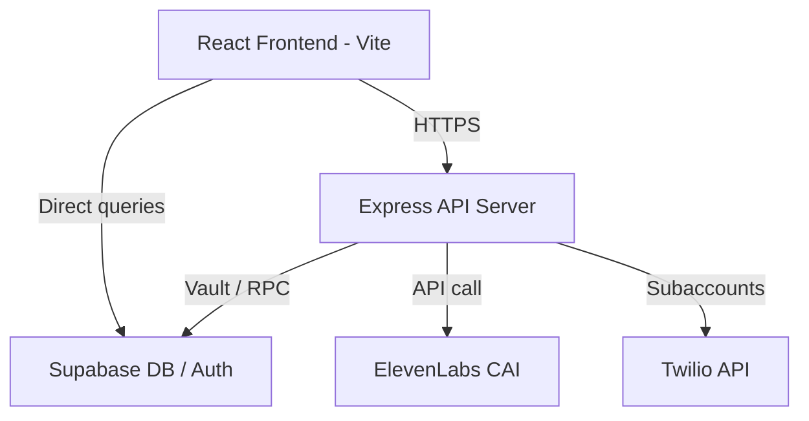

# Deployment Guide

This document describes how to deploy the Weeber platform to staging and production environments.

---

## 1. Architecture Overview



---

## 2. Infrastructure Hosting

### Frontend (React client)
* **Platform**: Vercel / Netlify (Static Hosting)
* **Configuration**:
  - Requires rewrite fallback rules for React Router (`vercel.json` config).
  - Environment variables must be set at build time (`VITE_API_BASE_URL`, `VITE_SUPABASE_URL`, `VITE_SUPABASE_ANON_KEY`).

### Backend (Express API)
* **Platform**: Railway (see `backend/railway.json` and `backend/Procfile`)
* **Configuration**:
  - Run command: `npm start` (defined in `backend/package.json`).
  - CommonJS runtime bindings.
  - Set `RUN_WORKERS=0` when running alongside the dedicated worker service.

### Worker Service (Background Processing)
* **Platform**: Railway (see `backend/railway.worker.json`)
* **Configuration**:
  - Run command: `node worker-entry.js` (or `npm run start:workers`).
  - Requires `SUPABASE_SERVICE_ROLE_KEY` to be set (will exit fatally otherwise).
  - Health probe on port `WORKER_HEALTH_PORT` (default: 3001).
  - Runs 6 workers: dialer, retry, billing-rollup, lease-sweeper, webhooks-out, call-scheduler.
  - Graceful shutdown on SIGTERM with 5-second drain timeout.
* **Scaling Notes**:
  - The API and Worker services share the same codebase but run different entry points.
  - Worker service has no Express HTTP server — only a minimal health endpoint.
  - Scale workers independently of the API (e.g., increase replicas during campaign bursts).
  - Database-native cron jobs (pg_cron) provide a fallback for lease reclamation and billing drift even if the worker service is down.

### Database & Auth (Supabase)
* **Hosting**: Supabase Cloud
* **Configuration**:
  - Run database migrations: `npx supabase db push` or apply via Supabase Console migrations editor.
  - Vault secrets must be registered inside Postgres Vault schema (`vault.decrypted_secrets`).

---

## 3. Environment Variables Catalog

Ensure the following properties are configured in the environment profile:

### Database & Auth
* `SUPABASE_URL`: The URL endpoint of the Supabase project.
* `SUPABASE_ANON_KEY`: Client-facing anonymized API key.
* `SUPABASE_SERVICE_ROLE_KEY`: Service account key used by backend to bypass RLS policies.

### Voice & Telephony
* `ELEVENLABS_API_KEY`: API token from ElevenLabs Profile settings.
* `VOICE_PROVIDER`: Set to `elevenlabs` for CAI integrations.
* `TWILIO_ACCOUNT_SID`: Master Twilio credential ID.
* `TWILIO_AUTH_TOKEN`: Master Twilio verification secret.
* `TWILIO_SANDBOX_MODE`: Set to `true` during local development to use simulated subaccount setups.

### Integrations & Billing
* `STRIPE_SECRET_KEY`: Stripe gateway integration token.
* `STRIPE_WEBHOOK_SECRET`: Secure webhook challenge signature validation token.
* `SHOPIFY_API_KEY`: Developer key for Shopify Partners OAuth integration.
* `SHOPIFY_API_SECRET`: Developer secret for HMAC parameter check verification.
* `WEEBERSH_INSTALL_URL`: Shopify app install redirect URL (default: `https://weebersh.com/api/auth`).
* `WEEBER_INTERNAL_SECRET`: Guards internal Shopify route endpoints (`/api/integrations/shopify/*`).
* `RESEND_API_KEY`: Resend email service API key for transactional emails.

---

## 4. Deploy Checklist

1. **Supabase Schema**: Check database sync state:
   ```bash
   supabase db lint
   supabase migration up
   ```
2. **Supabase Auth — Leaked Password Protection**: In the Supabase Dashboard, go to Authentication > Providers > Email and enable the **Leaked Password Protection** toggle. This enables HaveIBeenPwned breach detection and cannot be set via SQL migration.
3. **Supabase Auth — Connection Pool Strategy**: In the Supabase Dashboard, go to Database > Connection Pooling and switch the Auth pool from an absolute connection count to **percentage-based** allocation. This prevents Auth from consuming a fixed share of the connection pool under high load. This is a Dashboard-only setting and cannot be set via SQL migration.
4. **Supabase — PITR (Point-in-Time Recovery)**: In the Supabase Dashboard, go to Database > Backups and enable PITR. Provides continuous WAL archiving with recovery to any second in the last 7 days. Critical for financial data integrity.
5. **Supabase — Network Restrictions**: In the Supabase Dashboard, go to Database > Network Restrictions and restrict direct DB access to known IPs only (Railway service IPs, developer VPN CIDRs).
6. **Railway — Region Colocation**: Verify the Railway service region matches the Supabase project region (both should be the same AWS region, e.g., `us-east-1`). Cross-region DB calls add 40-80ms per query.
7. **Railway — Worker Service**: Deploy the worker service using `backend/railway.worker.json`. Set `RUN_WORKERS=0` on the API service and ensure `SUPABASE_SERVICE_ROLE_KEY` is configured on the worker service.
8. **Vercel — Deployment Protection**: Enable Vercel Deployment Protection for preview deployments to prevent unauthorized access to staging URLs.
9. **Twilio Subaccounts**: Verify Twilio sandbox environment keys if staging matches localhost bindings.
10. **Stripe Webhooks**: Bind Stripe webhook handlers to `/v1/webhooks/stripe`.
11. **ElevenLabs Profiles**: Verify Voice IDs mapped in `vertical_configs` exist on target ElevenLabs accounts.
12. **Static Assets**: Compile package assets:
   ```bash
   npm run build
   ```
